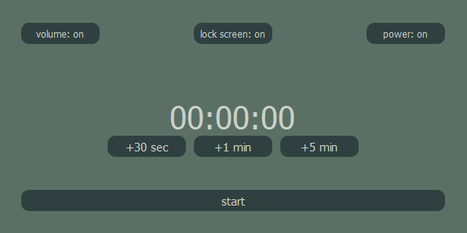

<p align="center">
  
</p>

# Timer

## PET project



**Smart Sleep Timer for a Peaceful Night**


Many of us enjoy watching a movie or listening to a show before falling asleep. However, sometimes, the screen keeps playing all night, disrupting sleep and consuming unnecessary energy. To solve this, I’ve developed a Smart Sleep Timer, a simple yet effective solution for better nighttime rest.

**Key Features:**

- ✅ Automatic Audio Mute – Gradually reduces the volume and mutes the sound after a set time.

- ✅ Screen Lock & Dimming – Prevents visual distractions by locking the screen.

- ✅ Auto Shutdown – Shuts down the PC at a scheduled time to save energy and prevent overnight playback.

With this tool, you can set a timer and let it take care of the rest. Whether you need a silent room for deep sleep or want to avoid unnecessary power consumption, this solution ensures a more comfortable and uninterrupted night.

### Installation

1. **Clone the repository** 

```bash
git clone https://github.com/CrudelisDeus/pet-timer
cd timer
```

2. **Install dependencies**

```bash
pip install -r requirements.txt
``` 

3. **Run the application**

```bash
python main.py
``` 